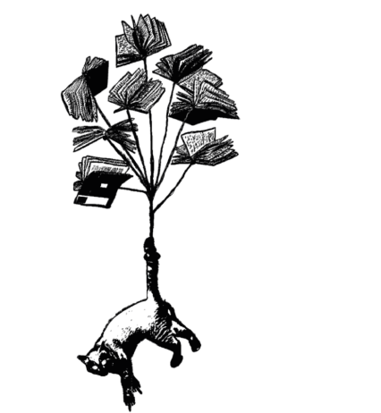

<h1 align="center">
   
  
   
Le Pôticha éditions 
</h1>
<h4 align="center">Création du site de la maison d'édition associative Le Pôticha - Projet final THP - Backend Rails API - Frontend React</h4>

## Présentation du projet 😺
Le Pôticha éditions est une maison d'édition associative toulousaine qui publie des textes de théâtre et fonctionne sur un système d'abonnements. Elle est présente sur les réseaux sociaux mais ne disposait jusqu'à ce jour pas d'un site web professionnel. Elle a fait appel à nous pour le réaliser. Ce site permet aux membres de l'association de documenter les activités de l'association :
- [x] actualité
- [x] publications
- [x] auteurices
- [x] temps restant avant la fermeture des abonnements

## Backend 😺
Pour consulter le github du backend ➡️ https://github.com/Sojabio/Poticha_back2.git

## Sur le web 😺
Pour consulter le site en ligne ➡️ https://poticha-front.vercel.app/

## Se connecter 😺
1. identifiant : admin@test.fr
2. mot de passe : azerty

## Installer le front en local 😺
1. `npm i`
1. `npm start`
1. ➡️ [http://localhost:3000](http://localhost:3000)

## Trello 😺
Pour consulter le trello du projet ➡️ https://trello.com/b/k35A5GLl/le-p%C3%B4ticha

## BDD 😺
Pour consulter la modélisation de la BDD ➡️ https://glorious-saltopus-43e.notion.site/BDD-poticha-7f0cd8cf4f9b4b0d9175484efde400d9

